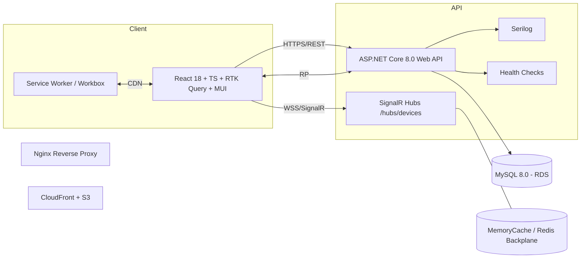
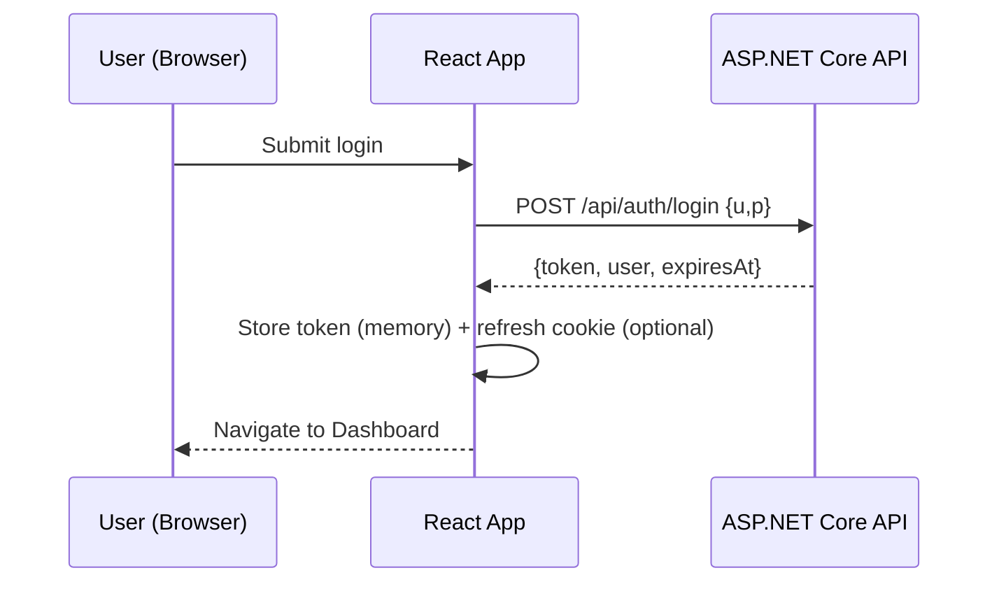
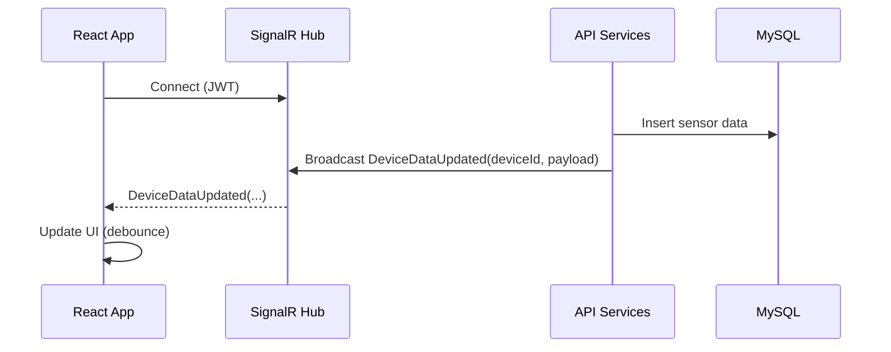
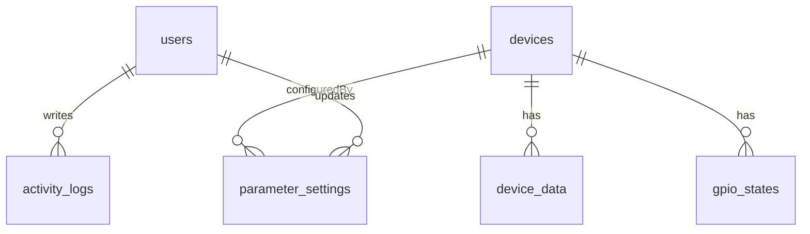

# Technical Design Document (TDD) – Cooling Manager Web Application

Audience: Full‑stack Developers, DevOps Engineers, QA Testers
Mục tiêu: Đội ngũ có thể bắt đầu phát triển ngay với kiến trúc, đặc tả API, database, hướng dẫn frontend, bảo mật, tiêu chuẩn phát triển, và triển khai.

---

## 1. Architecture Overview

### 1.1 System Diagram


### 1.2 Components
- Frontend: React 18, TypeScript 5, Vite, React Router 6, Redux Toolkit + RTK Query, MUI, @microsoft/signalr, Workbox (PWA)
- Backend: ASP.NET Core 8.0, EF Core (Pomelo MySQL), SignalR, Serilog, HealthChecks, MemoryCache (Redis backplane khi scale-out)
- Database: MySQL 8.0 (InnoDB, utf8mb4), partitioning cho time-series (device_data)
- Infra: Nginx reverse proxy, S3 + CloudFront cho SPA, ALB → Nginx → Kestrel, CI/CD GitHub Actions

---

## 2. API Specifications (31 endpoints)
Tất cả endpoints trả về envelope chuẩn:
```json
{ "success": true, "data": {}, "message": "", "error": null, "timestamp": "2025-08-08T08:00:00Z" }
```
Auth: Bearer JWT (access token), refresh token qua HTTP-only cookie (tuỳ chọn).

### 2.1 Authentication (4)
1) POST /api/auth/login
- Req: { username: string, password: string }
- Res: { token: string, expiresAt: datetime, user: { id, username, email, role } }
- Errors: 400 INVALID_CREDENTIALS, 423 ACCOUNT_DISABLED
2) POST /api/auth/refresh
- Req: (cookie refresh token) hoặc body { token }
- Res: như login
- Errors: 401 TOKEN_INVALID/EXPIRED
3) POST /api/auth/logout → 204, revoke refresh
4) GET /api/auth/validate → { valid: bool, user }

### 2.2 Devices (6)
1) GET /api/devices?search=&status=&page=&pageSize=&sort=&fields=
- Res: { data: Device[], total, page, pageSize }
2) GET /api/devices/{id} → Device detail (+latest sensor,gpio,params optional via fields)
3) POST /api/devices → Create (Admin/Technician)
4) PUT /api/devices/{id} → Update (Admin/Technician)
5) DELETE /api/devices/{id} → Soft delete (Admin)
6) GET /api/devices/statistics → { totalDevices, active, inactive, maintenance, error, warrantyActive }
- Errors: 404 DEVICE_NOT_FOUND, 409 DEVICE_ALREADY_EXISTS

### 2.3 Sensor Data (4)
1) GET /api/devices/{id}/data?start=&end=&page=&pageSize=
2) GET /api/devices/{id}/data/latest
3) POST /api/devices/{id}/data → IoT ingest (role device/API key)
4) GET /api/devices/{id}/data/stats?start=&end= → { min,max,avg,count }
- Validation: temperature [-50..100], pressure [0..50], voltage/current [0..1000]

### 2.4 GPIO (3)
1) GET /api/devices/{id}/gpio?start=&end=&page=&pageSize=
2) GET /api/devices/{id}/gpio/latest
3) POST /api/devices/{id}/gpio/control → { component: relay|fan|valve, number:1..4, action:on|off|open|close }
- Auth: Admin/Technician; Errors: 409 DEVICE_OFFLINE, 400 INVALID_COMMAND

### 2.5 Parameters (3)
1) GET /api/devices/{id}/parameters
2) PUT /api/devices/{id}/parameters → batch update [{ name, value, unit? }]
3) POST /api/devices/{id}/parameters/reset → optional subset
+ Extra: POST /api/devices/{id}/parameters/validate → trước khi commit

### 2.6 Reporting & Export (5)
1) GET /api/dashboard → KPIs, recent activities, alerts
2) GET /api/reports/devices?type=&start=&end=
3) GET /api/reports/alerts?severity=&status=&start=&end=
4) POST /api/export { dataType, deviceFilter, range, format } → { jobId }
5) GET /api/export/{jobId}/status → { status, url? }

### 2.7 Activities & System (6)
1) GET /api/activities?user=&action=&device=&start=&end=&page=&pageSize=
2) GET /api/activities/{id}
3) GET /api/audit/{entityType}/{entityId}
4) GET /api/system/info
5) GET /health
6) POST /api/devices/{id}/heartbeat (device keep-alive)

Sample Device schema (rút gọn):
```json
{
  "id": 1, "deviceId": "IOT001", "deviceName": "Freezer #1",
  "status": "active", "ownerName": "ABC Co.", "installationDate": "2024-02-01",
  "warrantyMonths": 24, "locationLat": 10.123456, "locationLng": 106.123456
}
```

Error codes chuẩn: VALIDATION_ERROR, UNAUTHORIZED, FORBIDDEN, DEVICE_NOT_FOUND, DEVICE_ALREADY_EXISTS, RATE_LIMITED, INTERNAL_ERROR.

Auth Requirement mapping: Admin full, Technician quản lý thiết bị/parameters/GPIO, User read-only.

Sequence (Authentication):


Sequence (Real-time updates):


---

## 3. Database Design

### 3.1 ERD (rút gọn)


### 3.2 Schemas (tóm tắt)
- users(id, username UNIQUE, email UNIQUE, password_hash, role, is_active, created_at, updated_at, last_login)
- devices(id, device_id UNIQUE, device_name, device_type, owner_name, phone_number, installation_date, installation_address, warranty_months, status, location_lat, location_lng, created_at, updated_at)
- device_data(id PK BIGINT, device_id FK, timestamp, temp_cold_storage, temp_environment, temp_solution, temp_compressor_head, temp_return, temp_saturation, pressure_suction, pressure_discharge, superheat_current, superheat_target, expansion_valve_ratio, eev_state, gpio_state_system, frz_ps_mode_run, frz_system_state, voltage_a, current_a, voltage_b, current_b, voltage_c, current_c)
- gpio_states(id PK BIGINT, device_id FK, timestamp, gpio_state_raw, relay1..relay4, alarm1..alarm4, fan1..fan4, valve1..valve4)
- activity_logs(id PK BIGINT, user_id FK, device_id, action, details JSON, ip_address, user_agent, created_at)
- parameter_settings(id, device_id FK, parameter_name UNIQUE per device, parameter_value, unit, description, updated_at, updated_by FK)

### 3.3 Indexes
- devices(device_id) UNIQUE, devices(status), devices(installation_date)
- device_data(device_id, timestamp), device_data(temp_cold_storage), device_data(pressure_suction)
- gpio_states(device_id, timestamp), activity_logs(user_id, action, created_at)
- parameter_settings(device_id, parameter_name) UNIQUE

### 3.4 Migration Scripts
- EF Core migrations theo code-first; hoặc SQL scripts seed (admin user, sample devices)
- Ví dụ (MySQL seed trích):
```sql
INSERT INTO users(username,email,password_hash,role) VALUES('admin','admin@cm.com','<bcrypt>','admin');
```

---

## 4. Frontend Implementation Guide

### 4.1 Folder Structure
```
src/
  app/ (store, providers)
  pages/ (Dashboard, Devices, DeviceDetail, Admin,...)
  features/
    auth/ devices/ sensors/ gpio/ params/ reports/ activities/
  components/ (UI atoms/molecules)
  services/ (apiClient, signalrClient)
  store/ (slices)
  styles/ utils/
```

### 4.2 State Management (Redux Toolkit + RTK Query)
- RTK Query cho server state: caching, re-fetch, polling, invalidation (tags: Devices, Sensors, GPIO, Params, Reports)
- Redux slices cho app state: auth, toasts, settings

### 4.3 Routing & Guards
- React Router 6: /login, /dashboard, /devices, /devices/:id/(overview|sensors|gpio|params|activity), /admin
- Guard: RequireAuth (JWT), RequireRole(Admin|Technician|User)

### 4.4 SignalR Integration Pattern
```ts
// services/signalrClient.ts
import * as signalR from '@microsoft/signalr';
export const buildHub = (token:()=>string) => new signalR.HubConnectionBuilder()
 .withUrl('/hubs/devices', { accessTokenFactory: token })
 .withAutomaticReconnect({ nextRetryDelayInMilliseconds: c => Math.min(30000, (2 ** c) * 1000) })
 .build();
```
- Subscriptions theo màn hình; debounce 250–500ms; fallback polling 30s khi mất kết nối >60s

### 4.5 Forms & Validation
- react-hook-form + Zod/Yup schemas; hiển thị lỗi field‑level; submit disabled khi invalid
- Mapping HTTP: 400/422 → lỗi form; 401 → redirect login; 403 → thông báo quyền; 429 → countdown; 5xx → retry/toast

---

## 5. Security Implementation
- JWT: access in‑memory; refresh (optional) HTTP‑only, Secure, SameSite=Strict cookie; rotate refresh
- CORS: allow origins theo env; methods GET/POST/PUT/DELETE/OPTIONS; headers Authorization, Content-Type; expose ETag, X-Correlation-ID
- CSP: default-src 'self'; connect-src 'self' https://api... wss://api...; img-src 'self' data:; object-src 'none'
- RBAC: policy AdminOnly, TechnicianOrAdmin, AllUsers (server); UI ẩn chức năng không đủ quyền
- Headers: X-Frame-Options DENY, X-Content-Type-Options nosniff, Referrer-Policy, HSTS

---

## 6. Development Standards
- Code style: ESLint + Prettier (FE), .editorconfig; C# style conventions (BE)
- Naming: kebab-case (files FE), PascalCase (components/classes), camelCase (vars), snake_case (DB)
- Commit: Conventional Commits; PR templates; code review ≥ 1 reviewer
- Testing: FE unit/component/e2e; BE unit/integration/contract; coverage ≥ 80%
- Definition of Done (mỗi feature):
  - Code + unit tests + docs; lint/format pass; E2E happy path; security review (nếu liên quan); monitoring dashboards cập nhật; feature flags (nếu cần)

---

## 7. Deployment Instructions

### 7.1 Docker
- FE Dockerfile (build → static):
```Dockerfile
FROM node:20 as build
WORKDIR /app
COPY package*.json ./
RUN npm ci
COPY . .
RUN npm run build
FROM nginx:alpine
COPY --from=build /app/dist /usr/share/nginx/html
```
- BE Dockerfile (ASP.NET 8):
```Dockerfile
FROM mcr.microsoft.com/dotnet/sdk:8.0 AS build
WORKDIR /src
COPY . .
RUN dotnet publish -c Release -o /out
FROM mcr.microsoft.com/dotnet/aspnet:8.0
WORKDIR /app
COPY --from=build /out .
ENTRYPOINT ["dotnet","CoolingManagerAPI.dll"]
```
- docker-compose (local dev): API + DB + Web + Redis (optional)

### 7.2 CI/CD (GitHub Actions – rút gọn)
```yaml
name: ci
on: [push]
jobs:
  build-test:
    runs-on: ubuntu-latest
    steps:
      - uses: actions/checkout@v4
      - uses: actions/setup-node@v4
        with: { node-version: 20 }
      - run: npm ci && npm run lint && npm test && npm run build
      - uses: actions/setup-dotnet@v4
        with: { dotnet-version: '8.0.x' }
      - run: dotnet restore && dotnet test && dotnet publish -c Release
```

### 7.3 Environments & Variables
- FE: VITE_API_BASE_URL, VITE_SIGNALR_URL, VITE_LOG_LEVEL
- BE: ConnectionStrings:Default, Jwt:Secret/Issuer/Audience, CORS:AllowedOrigins, Serilog paths, RateLimit, Redis config

### 7.4 Monitoring
- Health checks endpoints; Serilog structured logs; metrics (throughput, p95, 5xx, SignalR connections)
- Alerts: 5xx >1%, DB down, HC fail

---

## 8. Effort Estimation (rút gọn)
- FE Auth + Routing + Guards: 16–24h (8 SP)
- FE Devices list/detail (read): 24–32h (13 SP)
- FE Sensors (latest/history) + charts: 24–40h (13–20 SP)
- FE GPIO status/control: 24–32h (13 SP)
- FE Parameters CRUD + validation: 24–40h (13–20 SP)
- FE Reports + Export: 24–40h (13–20 SP)
- FE Dashboard real‑time: 24–32h (13 SP)
- BE tweaks (ETag, fields, export streaming): 24–40h (13–20 SP)
- DevOps (CI/CD, Docker, CDN, monitoring): 24–32h (13 SP)
- QA test plans & automation: 24–40h (13–20 SP)

---

## 9. Definition of Done per Feature
- Có thiết kế UI (wireframe), route, component + state
- API contract chốt (OpenAPI), unit tests FE/BE
- Validation + error handling đầy đủ; i18n (nếu áp dụng)
- Telemetry: logs/metrics/tracing; dashboards cập nhật
- Docs: README feature, instructions QA
- Passed code review, CI xanh, e2e happy path, không regression critical

