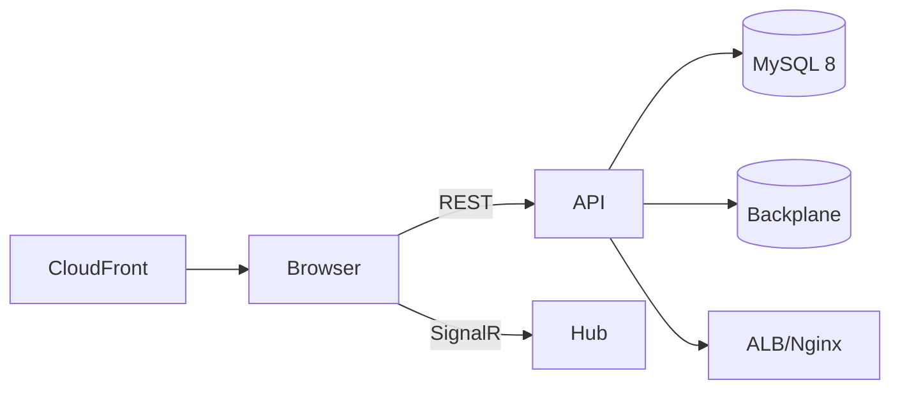
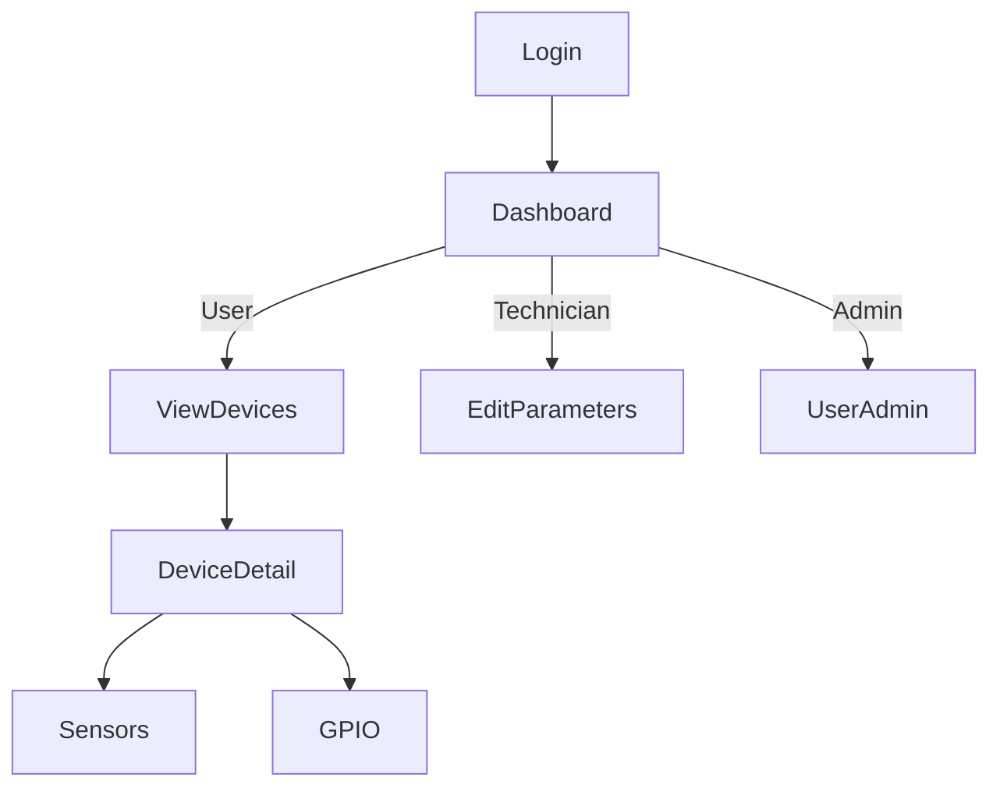

# Thiết kế Ứng dụng Web - Cooling Manager

Tác giả: Solution Architect
Mục tiêu: Xây dựng ứng dụng web từ đầu (greenfield) cho hệ thống Cooling Manager, tái sử dụng back-end REST API hiện có, bảo toàn đầy đủ chức năng, tối ưu bảo mật/hiệu năng và đảm bảo khả năng mở rộng dài hạn.

---

## 1. Tổng quan Hệ thống Web
- Back-end giữ nguyên: ASP.NET Core 8.0, REST API, SignalR, MySQL 8.0 (EF Core), Serilog, Health Checks.
- Dữ liệu: RDS MySQL với partitioning cho bảng time-series (device_data), indexes tối ưu sẵn (details trong back_end_developer.md).
- Chức năng: 3 roles (Admin/Technician/User), 31 endpoints, real-time sensor monitoring, GPIO control, parameters, reporting, activity logging, export.
- Điều chỉnh chính cho web:
  - Bật CORS cho origin web.
  - Tối ưu API cho trình duyệt: ETag/If-None-Match, response caching, truy vấn lựa chọn trường (fields=...).
  - Chuẩn hóa error envelope, correlation id.
  - Bổ sung lựa chọn lưu trữ refresh token (HTTP-only cookie) và access token (in-memory) cho SPA.

---

## 2. Kiến trúc Web Front-end
### 2.1 Lựa chọn framework & phân tích trade-offs
- Đề xuất chính: React 18 + TypeScript 5 + Vite
  - Ưu điểm: hệ sinh thái lớn, PWA/SSR linh hoạt, thư viện giàu (MUI/Tailwind), tooling nhanh, đội ngũ dễ tuyển.
  - Nhược: cần tuân thủ nghiêm ngặt security (XSS), tự quản state/kiến trúc.
- Phương án thay thế (so sánh ngắn):
  - Blazor WASM: full .NET, chia sẻ model; nhược: bundle lớn, cold start, PWA tốt.
  - Blazor Server: latency phụ thuộc network, stateful trên server; đơn giản hóa auth/SSE, hạn chế offline.
  - Angular: opinionated, tốt cho enterprise lớn; đường cong học tập cao.
  - Vue: nhẹ, nhanh; hệ sinh thái enterprise nhỏ hơn React/Angular.

Chọn React + TS cho tốc độ phát triển, PWA, cộng đồng và khả năng tuyển dụng. (Có thể cung cấp blueprint Blazor nếu tổ chức ưu tiên full .NET trong tương lai).

### 2.2 Kiến trúc component & state management
- Thư mục đề xuất:
  - src/app (bootstrap, providers), src/pages, src/features (devices, auth, reports,...), src/components (ui), src/services (api, signalr), src/store, src/styles.
- State:
  - Global: auth/user/role, app settings, toasts.
  - Server state: dùng Redux Toolkit Query (RTK Query) hoặc React Query để caching, de-dup, polling, retries.
  - Local/ephemeral: form inputs, UI state.
- Routing: React Router v6 (protected routes theo role).
- UI kit: MUI 6 (hoặc Tailwind + HeadlessUI). MUI đem lại accessibility tốt.

### 2.3 Responsive & PWA
- Breakpoints: mobile ≤ 767px, tablet 768–1279px, desktop ≥ 1280px.
- PWA: Workbox (precaching shell, runtime caching cho API read, Background Sync cho hàng đợi ghi khi offline), icon/splash, offline fallback.

### 2.4 Authentication & Role-based UI
- Flow: Login → nhận access token (in-memory) + refresh token (HTTP-only Secure SameSite=Strict cookie) → refresh silent trước khi hết hạn 2 phút.
- UI guard theo role; ẩn/bỏ disabled các thao tác không đủ quyền; backend vẫn enforce RBAC.

### 2.5 Real-time Updates (SignalR)
- @microsoft/signalr kết nối hub `/hubs/devices` với Bearer token.
- Subscriptions theo device/current view; debounce cập nhật UI 250–500ms.
- Reconnect exponential backoff (1s → 30s); fallback polling 30s nếu mất kết nối > 60s.



---

## 3. Điều chỉnh Back-end cho web client
### 3.1 CORS & Bảo mật trình duyệt
- CORS: allow origins cấu hình; methods GET/POST/PUT/DELETE/OPTIONS; headers Authorization, Content-Type; expose ETag, X-Correlation-ID.
- HTTPS bắt buộc, HSTS, TLS1.2+; Nginx thêm CSP, X-Frame-Options DENY, X-Content-Type-Options nosniff.
- JWT: access token ngắn hạn (15–30 phút) trong bộ nhớ; refresh token HTTP-only cookie (Secure, SameSite=Strict) nếu dùng cookie refresh.
- CSRF: chỉ cần nếu dùng cookie cho access token; với mô hình đề xuất (access in-memory) → không cần CSRF cho API.

### 3.2 Tối ưu API cho trình duyệt
- ETag/If-None-Match cho GET (devices, parameters, latest data) → 304.
- Query trường: `fields=deviceId,deviceName,status` để giảm payload.
- Pagination chuẩn và metadata; limit pageSize ≤ 1000.
- Gzip/Brotli, HTTP/2. Response caching 30–120s cho read endpoints ít thay đổi.
- Batch endpoints: POST /data: [{...}] (tùy chọn), streaming cho export (chunked).

### 3.3 Session & Security considerations
- Token rotation cho refresh token, revoke khi logout/compromise.
- Rate limiting per-IP & per-user; anomaly detection đăng nhập.
- Audit trail đầy đủ; ẩn PII trong logs.

### 3.4 Upload/Download cho web
- Export: stream CSV/Excel (content-disposition); large file qua pre-signed URL (S3) + background job.
- Upload (nếu phát sinh): multipart, giới hạn kích thước, virus scan (tùy chọn), lưu S3; DB chỉ lưu metadata.

---

## 4. Thông số Kỹ thuật
### 4.1 Front-end stack
- React 18, TypeScript 5, Vite, React Router 6, Redux Toolkit + RTK Query, MUI 6, @microsoft/signalr, Workbox, ESLint/Prettier, Vitest/Jest, Playwright.

### 4.2 Back-end stack (giữ nguyên + bổ sung)
- ASP.NET Core 8, EF Core (Pomelo MySQL), Serilog, HealthChecks, SignalR, MemoryCache, ResponseCaching, Redis backplane (AWS ElastiCache), Nginx reverse proxy.

### 4.3 Database
- Không thay đổi schema lõi. Bổ sung (khuyến nghị):
  - refresh_tokens (rotation/audit), user_sessions (device, ip, ua), api_keys (cho IoT devices) nếu chưa có.

### 4.4 Triển khai & Hạ tầng
- Containerization: Docker cho API và Web (static build); docker-compose/k8s (EKS) giai đoạn sau.
- CDN: CloudFront cho assets; S3 static hosting cho SPA.
- Backend: ALB → Nginx → Kestrel; AutoScaling group.
- SignalR scale-out: Redis backplane.
- CI/CD: GitHub Actions (build, test, scan, deploy); Blue/Green hoặc rolling.

### 4.5 Bảo mật
- HTTPS bắt buộc; CSP strict: default-src 'self'; connect-src 'self' api.cooling... wss://api.cooling...; img-src 'self' data:; object-src 'none'.
- XSS: encode output, tránh dangerouslySetInnerHTML, dùng DOMPurify khi render rich text.
- SRI cho scripts/styles third-party; Dependency scanning (Dependabot/Snyk).
- Security headers: Referrer-Policy, Permissions-Policy, Frame-Options, HSTS.

### 4.6 Hiệu năng
- Front-end: code splitting, route-level chunks, prefetch, image optimization, CSS critical, tree-shaking.
- Back-end: caching, compiled queries, indexes, p95 API < 300ms, Web Vitals: LCP < 2.5s, TTI < 2s (broadband), CLS < 0.1.

---

## 5. Kế hoạch Phát triển Web Application
### 5.1 Roadmap triển khai Web (Greenfield)
1) Hạ tầng & Base (1–2 tuần)
- CORS, ETag, response caching, SignalR backplane (nếu cần scale-out).
- Thiết lập CI/CD, S3 + CloudFront, domain/subdomain app.

2) MVP (2–3 tuần)
- Auth (JWT + refresh), Dashboard, Device list/detail (read-only), Sensor latest/history (read-only), thống kê cơ bản.

3) Real-time & Control (2–3 tuần)
- SignalR live updates; GPIO status/history; GPIO control với xác nhận 2 bước (nếu phần cứng hỗ trợ).

4) Parameters & Reports (2–3 tuần)
- CRUD parameters (RBAC đầy đủ), export/report streaming.

5) Admin & Audit (2 tuần)
- User management, activity logs/audit trail UI.

6) Ổn định & tối ưu (1–2 tuần)
- Tối ưu hiệu năng, hardening bảo mật, PWA offline nâng cao, theo dõi SLOs.

### 5.2 Quản lý rủi ro & chất lượng
- Feature flags cho tính năng mới; gradual exposure.
- Blue/Green hoặc canary cho web assets; giữ version n-1 trên CDN để rollback nhanh.
- Bộ tiêu chí chất lượng: Core Web Vitals, error rate, API p95 latency.

### 5.3 Enablement & Adoption
- Tài liệu hướng dẫn, quick start, tooltips, Guided tour.
- Kênh hỗ trợ (email/slack) giai đoạn đầu; thu feedback, telemetry.

---

## 6. Yêu cầu UI/UX
### 6.1 Wireframes (mô tả)
- Dashboard: cards thống kê (total/active/maintenance/error), list alerts, recent activity, health.
- Device List: bảng filter + sort + pagination; quick status; search.
- Device Detail: tabs (Overview, Sensors, GPIO, Parameters, Activity).
- Parameters: grouped sections (Temperature, Pressure, Timing) + validation inline.
- Admin: Users list + role assignment + reset password.

### 6.2 Breakpoints & Layout
- Mobile: 1 cột; Tablet: 2 cột; Desktop: 3–4 cột tùy nội dung.
- DataGrid dùng horizontal scroll trên mobile, ưu tiên card view.

### 6.3 Accessibility (WCAG 2.1 AA)
- Focus visible, keyboard navigation, ARIA landmarks/roles.
- Contrast ratio ≥ 4.5:1; thông báo có aria-live polite.
- Form labels, error messages liên kết với inputs.

### 6.4 User Flows theo Role


---

## 7. Security & Performance Considerations
- Security: RBAC ở cả UI và API; token rotation; strict CSP; không lưu token ở localStorage; audit logging; bảo vệ exports.
- Performance: cache-first cho đọc, incremental loading; virtualization lists; server hints (ETag, Cache-Control, gzip/brotli).
- Resilience: retry idempotent GET; circuit breaker (client); graceful degradation nếu mất SignalR.

---

## 8. Testing Strategy
- Front-end: unit (Vitest/Jest), component (React Testing Library), e2e (Playwright/Cypress), Lighthouse/PWA audits.
- Back-end: unit/integration, contract tests so khớp OpenAPI (Dredd/Prism), load (k6), security (OWASP ZAP), SignalR tests.
- CI: chạy tests, lint, build; gate bởi quality metrics (coverage ≥ 80%, Lighthouse PWA ≥ 90, LCP < 2.5s).

---

## 9. Phụ lục: Mẫu cấu hình & snippet
### 9.1 CORS (ASP.NET Core)
```csharp
builder.Services.AddCors(options =>
{
  options.AddPolicy("WebOrigins", p => p
    .WithOrigins("https://app.coolingmanager.com")
    .AllowAnyMethod()
    .AllowAnyHeader()
    .WithExposedHeaders("ETag","X-Correlation-ID")
    .AllowCredentials());
});
app.UseCors("WebOrigins");
```

### 9.2 SignalR client (React)
```ts
import * as signalR from '@microsoft/signalr';
const connection = new signalR.HubConnectionBuilder()
  .withUrl('https://api.coolingmanager.com/hubs/devices', { accessTokenFactory: () => accessToken })
  .withAutomaticReconnect({ nextRetryDelayInMilliseconds: c => Math.min(30000, (2 ** c) * 1000) })
  .build();
connection.on('DeviceDataUpdated', (deviceId, payload) => updateUI(deviceId, payload));
await connection.start();
```

### 9.3 PWA Workbox runtime caching (ví dụ)
```js
workbox.routing.registerRoute(
  ({url}) => url.origin === 'https://api.coolingmanager.com' && url.pathname.startsWith('/api/devices'),
  new workbox.strategies.StaleWhileRevalidate({
    cacheName: 'api-devices',
    plugins: [new workbox.expiration.ExpirationPlugin({maxEntries: 100, maxAgeSeconds: 120})]
  })
);
```

---

## 10. Lộ trình triển khai (ước lượng)
- Tổng: 8–14 tuần tùy năng lực đội ngũ và phạm vi tùy biến UI
  - Hạ tầng & CI/CD: 1–2 tuần
  - MVP (Auth + Device read): 2–3 tuần
  - Real-time + GPIO: 2–3 tuần
  - Parameters + Reports + Export: 2–3 tuần
  - Admin + Audit: 2 tuần
  - Ổn định & tối ưu: 1–2 tuần

Kế hoạch có thể chạy song song theo squad để rút ngắn timeline.

